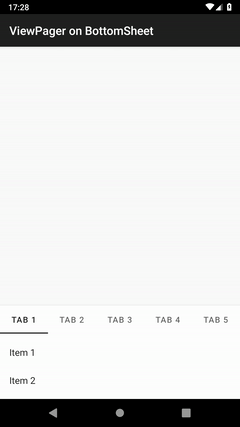

# android-bottomsheet-viewpager

A sample app to demonstrate a solution to put [`ViewPager`](https://developer.android.com/reference/androidx/viewpager/widget/ViewPager) on extentable bottom sheet. The core class is [`BottomSheetViewPager`](./app/src/main/java/io/github/kafumi/bottomsheetviewpager/BottomSheetViewPager.kt).



## The scrolling issue of ViewPager on bottom sheet

[`BottomSheetBehavior`](https://developer.android.com/reference/com/google/android/material/bottomsheet/BottomSheetBehavior) supports only single scrollable child view. If there is a `ViewPager` and it has multiple scrollable views, user can not scroll them as expected.

See following Stack Overflow threads for more details.

- [Android ViewPager with RecyclerView works incorrectly inside BottomSheet - Stack Overflow](https://stackoverflow.com/q/37715822)
- [android - Scroll not working for multiple RecyclerView in BottomSheet - Stack Overflow](https://stackoverflow.com/q/39326321)

## My solution

The workaround is implemented by [`BottomSheetViewPager`](./app/src/main/java/io/github/kafumi/bottomsheetviewpager/BottomSheetViewPager.kt). Scroll should be performed as expected by using this class instead of standard `ViewPager`.

[`BottomSheetBehavior`](https://developer.android.com/reference/com/google/android/material/bottomsheet/BottomSheetBehavior) uses [`findScrollingChild(View)`](https://github.com/material-components/material-components-android/blob/8073c98d604279fe26ac95fcc60c70882cace7df/lib/java/com/google/android/material/bottomsheet/BottomSheetBehavior.java#L733-L747) to find scrollable child. `BottomSheetViewPager` overrites `getChildAt(Int)` to return displayed page's view if the caller is `BottomSheetBehavior.findScrollingChild(View)`.

### Proguard/R8

This solution uses the names of `ViewPager.LayoutParams#position` and `BottomSheetBehavior#findScrollingChild()`. You need to protect them from obfuscation and shrink with following ProGuard rules if you enable ProGuard or R8.

```proguard
-keep class androidx.viewpager.widget.ViewPager$LayoutParams { int position; }
-keep class com.google.android.material.bottomsheet.BottomSheetBehavior { *** findScrollingChild(...); }
```

## Another solution

[ViewPagerBottomSheet](https://github.com/laenger/ViewPagerBottomSheet) is another great solution for the problem. It provides a custom [`ViewPagerBottomSheetBehavior`](https://github.com/laenger/ViewPagerBottomSheet/blob/master/vpbs/src/main/java/biz/laenger/android/vpbs/ViewPagerBottomSheetBehavior.java) which takes care `ViewPager`'s children.

However, we need to note `ViewPagerBottomSheetBehavior` is a replacement of Google's `BottomSheetBehavior`. It means we can't use the latest updates of `BottomSheetBehavior` until `ViewPagerBottomSheetBehavior` includes the updates into the library source code.

If you want to use standard `BottomSheetBehavior`, this app's [`BottomSheetViewPager`](./app/src/main/java/io/github/kafumi/bottomsheetviewpager/BottomSheetViewPager.kt) might work better for you.